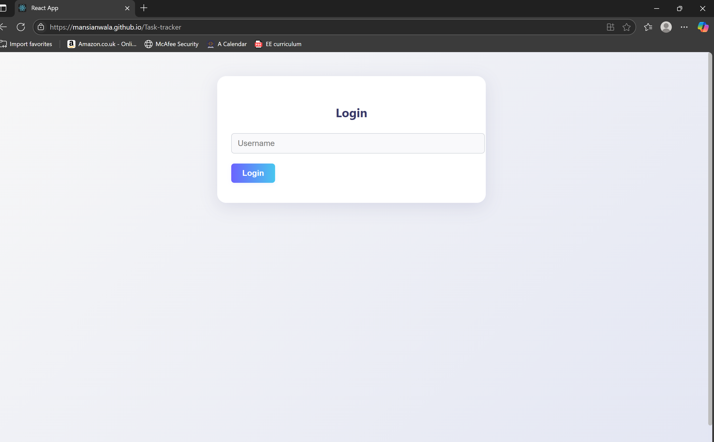

# Personal Task Tracker

## 📖 Description
A modern, multi-user personal task tracker web app built with React. Each user can securely log in, manage their own tasks, and enjoy a responsive, dark-mode-enabled interface. Tasks are stored per user in localStorage, ensuring privacy and persistence across sessions. The app is fully mobile responsive and deployable to GitHub Pages.

## 🚀 Features
- Multi-user login system (username only, no password for demo)
- Per-user task storage in localStorage (`tasks_{username}`)
- Add, edit (modal), delete, and toggle complete for tasks
- Filter tasks (All / Completed / Pending)
- Search tasks by title
- Task counts (all, completed, pending)
- Dark mode toggle (persistent)
- Mobile responsive UI
- Logout button and login redirect protection
- GitHub Pages ready (SPA routing supported)

## 🛠 Setup Instructions
1. Clone the repository
2. Run `npm install`
3. Run `npm start`
4. Open [http://localhost:3000](http://localhost:3000)

### Deploy to GitHub Pages
- Set `homepage` in `package.json` to your repo URL (e.g., `https://yourusername.github.io/Task-tracker`)
- Run `npm run build`
- Deploy the `build` folder to GitHub Pages
- Add a `public/_redirects` file with:
  ```
  /*    /index.html   200
  ```
  to support client-side routing

## 🧰 Technologies Used
- React.js
- react-router-dom
- LocalStorage API
- Modern CSS (flexbox, media queries)

## 🔗 Live Demo
[deployed app link here,. https://mansianwala.github.io/Task-tracker]

## 🖼 Screenshots
![Login Screen]
)


